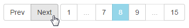

Pager UI
========

A generic pager widget for R/Shiny based applications.



## Features

* Prev / Next buttons
* Dynamically rendered page number buttons
    * displays all if &leq; 10 pages
    * smart display of spacer `...` buttons for larger ranges
* R functions `pageruiInput()` (for `ui.R`) and `updatePageruiInput()` (for
  `server.R`) make it simple to use in any Shiny application

## Application

Provide paging abilities to data sets that require more processing / rendering 
than a table.

## Installation

If you don't have the `devtools` package, install it:

```r
install.packages('devtools')
```

This allows you to install packages directly from GitHub.
Install this package:

```r
devtools::install_github('wleepang/shiny-pager-ui')
```

## Run the demo

Run the following to see the widget in action:

```r
library(shinyPagerUI)
runExamplePagerUI()
```

The source for the example application is in:

```
inst/example_app
```

## Use the widget

1. In the `global.R` file (create it if it doesn't exist) add the line:

```r
library(shinyPagerUI)
```

2. In `ui.R` add the widget as needed using `pageruiInput()`.
3. In `server.R` use `updatePageruiInput()` in reactive contexts that need to 
   update the widget.

## Examples

In `ui.R`:
* add a pager with id `pager`:

```r
pageruiInput('pager')
```

* add a pager-ui with id `pager` and initial current page of 5, initial total pages 10:

```r
pageruiInput('pager', page_current = 5, pages_total = 10)
```

In `server.R`:
* retrieve the current value from a pager-ui with id `pager`

```r
pager_state = input$pager

## str(pager_state) 
##> List of 2
##>  $ page_current: int 1
##>  $ pages_total : int 4
```

* update the current page of a pager-ui with id `pager`

```r
updatePageruiInput(session, 'pager', page_current = new_page_current)
```

* update the total number of pages available on a pager-ui with id `pager`

```r
updatePageruiInput(session, 'pager', pages_total = new_pages_total)
```

* update both the current page and total number of pages for a pager-ui with id `pager`

```r
updatePageruiInput(session, 'pager', 
                   page_current = new_page_current, 
                   pages_total = new_pages_total)
```
